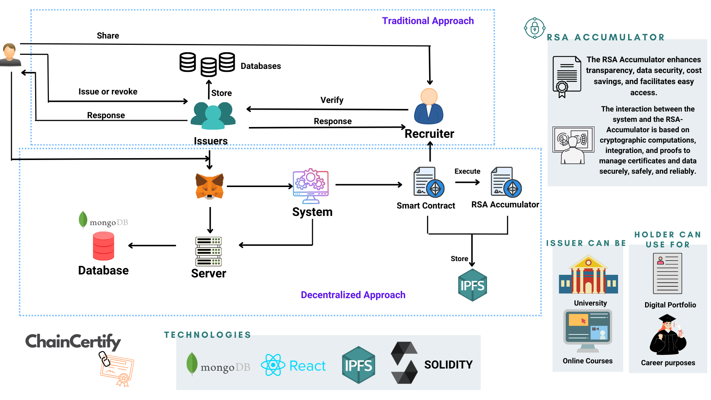
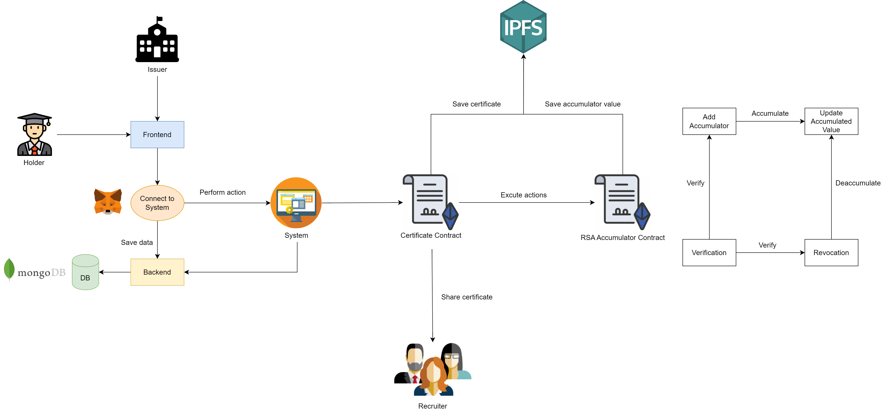
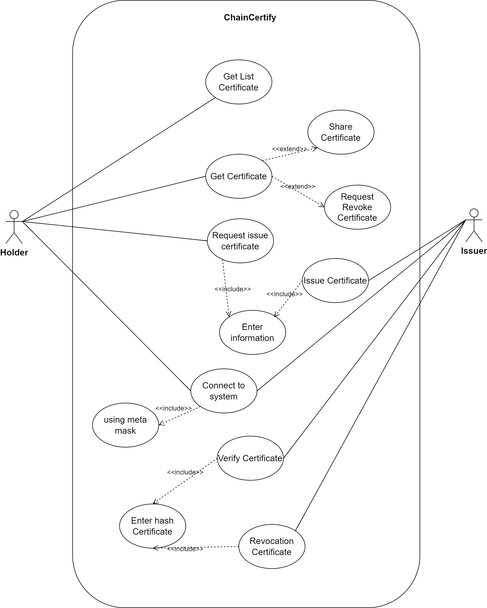
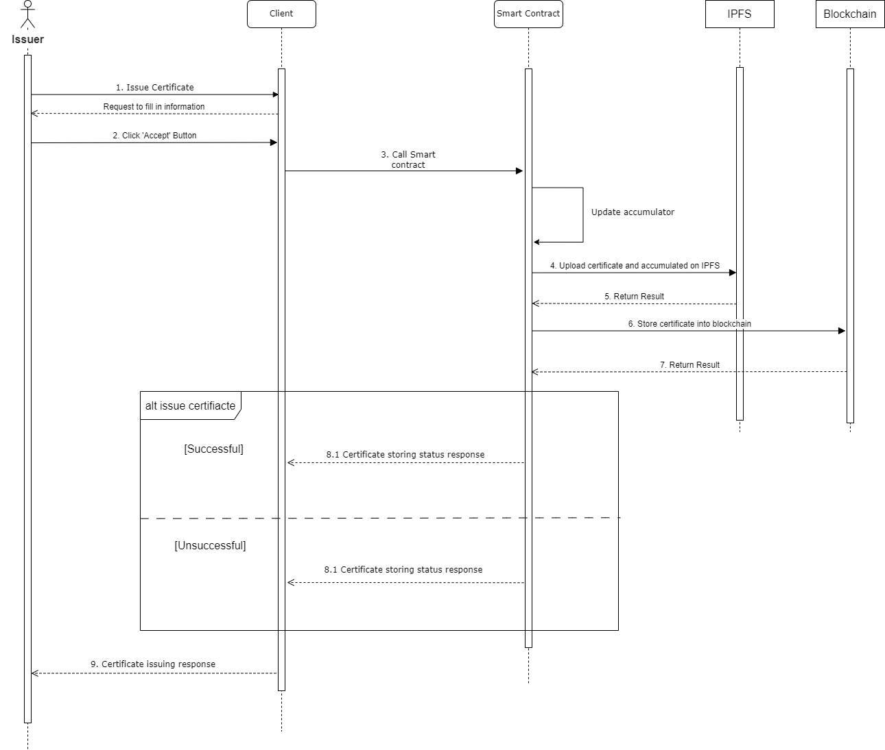
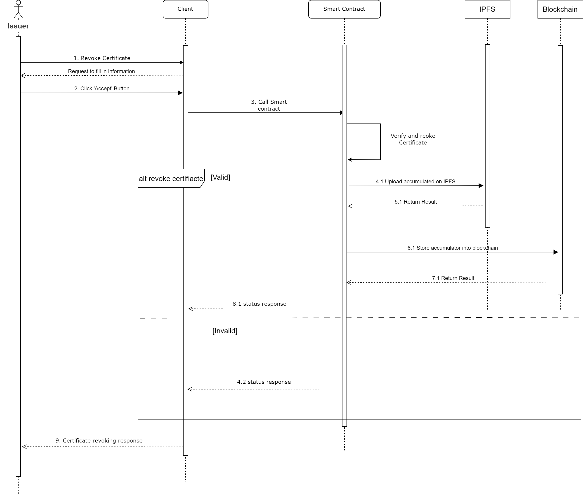

# 1. Title

ChainCertify: RSA-Accumulator Cert Management.

## 2. Product Description

### 2.1. Application Domain

The issuance and revocation of certificates through an RSA Accumulator-integrated smart contract system, known as ChainCertify, holds promising potential across various domains. It offers convenience, transparency, and security to the certificate management process.

In the field of education[3]: The issuance and revocation of certificates through a smart contract system can enhance the efficient management of academic certificates for universities, professional training centers, and other educational institutions. Instead of relying on paper documents prone to loss or forgery, this system employs blockchain technology to store certificate information and securely facilitate issuance and revocation transactions. Students or learners can easily verify their certificates without direct contact with the issuing organization.
In the healthcare sector[2]: This system can also be applied to manage specialized medical certificates and prescriptions. The automated issuance and revocation process through smart contracts can save time and ensure accuracy.

The RSA Accumulator-powered certificate issuance and revocation system, ChainCertify, holds the potential for widespread application in various domains, promoting transparency, security, and convenience in managing certificates and related information.

### 2.2. Challenges

Traditional certificate management and issuance face several challenges, including low security, time consumption, difficulty in verification, and lack of transparency. Tracking and retrieving the issuance and revocation history in traditional systems are also challenging, lacking an easy mechanism for transparency. Reliance on multiple third parties introduces complexity and increases the risk of errors.

The advent of the internet has brought significant changes to certificate management. The transition to online processes has facilitated the exchange and sharing of certificate information, saving time and resources. However, this rapid development also poses security challenges, necessitating strong security measures. Centralized systems also encounter issues, as reliance on a few intermediaries can lead to reduced transparency and potential obstacles. Incidents involving third parties or technical problems can impact centralized systems.

In this context, with the growing adoption of blockchain technology, including Smart Contracts, the issuance, revocation, and management of certificates have advanced further through decentralized systems. The application of RSA Accumulator alongside smart contracts can address these challenges by enhancing security through information encryption and blockchain storage, preventing certificate forgery, data tampering, and the need to disclose certificate information during verification. Simultaneously, the automation of the issuance and revocation process optimizes procedures and reduces the errors commonly associated with manual processes. Additionally, recording transactions on the blockchain through smart contracts ensures transparency in certificate management. All parties involved can easily verify the issuance and revocation history, creating a transparent and immutable data environment.

### 2.3. Pros and Cons of Smart Contracts [1]

Smart contracts are a vital component of blockchain technology, enabling automated transactions and agreements without intermediaries, based on predefined conditions. Smart contracts are programmed and executed on the blockchain platform, ensuring the integrity and transparency of transactions.

**Benefits of Smart Contracts:**

- **Autonomy and Savings:** Smart contracts eliminate the need for intermediaries, reducing the risk of manipulation and resulting in cost savings.
- **Backup:** Data stored on the blockchain is duplicated, ensuring the ability to recover originals in case of data loss.
- **Security:** Smart contracts use encryption and cryptography to secure documents from unauthorized access.
- **Speed:** Automation through smart contracts reduces the time required for various processes.
- **Accuracy:** Smart contracts eliminate errors from manual processes, leading to more precise execution.

**Limitations of Smart Contracts:**

- **Difficult to Change:** Modifying smart contract processes is challenging; errors in the code can require time-consuming corrections.
- **Loopholes:** Ensuring ethical and fair dealings is complex with smart contracts, as terms need to be met precisely as agreed upon.
- **Third Party Involvement:** While aiming to eliminate third parties, complete removal is not feasible. Third parties assume altered roles compared to traditional contracts.
- **Vague Terms:** Smart contracts may struggle with unclear terms that rely on precise code execution.

### 2.4. ChainCertify Certificate Management System

Based on the understanding of certificate management systems and the current challenges they face, we have chosen a typical use case for certificate management: university certificate management. By utilizing smart contracts and RSA Accumulator, ChainCertify enhances transparency, data security, cost savings, accessibility, and fraud prevention.

#### 2.4.1. Certificate Issuance Process

**Certificate Creation:** The Certificate Contract generates a certificate using user-provided information.
**Certificate Information Verification:** Ensures accurate certificate information.
**Proof Creation and Accumulator Update:** Creates issuance proofs and adds certificates to the RSA Accumulator for management.
**Data Upload to IPFS:** Certificate information and Accumulated Value are stored on IPFS to ensure data integrity and retrieval efficiency.
**Certificate Issuance to Holder:** Valid certificates are automatically issued to holders.

#### 2.4.2. Certificate Revocation Process

**Certificate Verification:** Determines the validity and issuance status of a certificate.
**Revocation:** Upon successful verification, the smart contract generates a revocation proof and updates the RSA Accumulator's value.
**IPFS Data Update:** Updates any changed information on IPFS.
**Successful Revocation Notification.**

#### 2.4.3. Interaction with RSA Accumulator

RSA Accumulator plays a continual role in the decentralized certificate and data management process.

**Certificate Issuance:**

1. System receives a request to issue a new certificate for an entity.
2. System creates certificate-related information, including recipient details and relevant data.
3. System performs encryption calculations to integrate the certificate information into the RSA Accumulator.
4. Witness and proof sets regarding certificate issuance can also be generated for later validation.
5. **Certificate Validity Verification:**

- To verify certificate validity, the system uses certificate data to compute the corresponding hash value.
- Proof and witness are used to demonstrate the existence of the certificate hash value in the RSA Accumulator.
- If proof and witness are valid, the system verifies that the certificate is unrevoked and can be accepted.

**Certificate Revocation:**

1. When a certificate needs to be revoked (e.g., expired, no longer valid), the system computes the hash value of the certificate.
2. Using deaccumulation, the system updates the accumulator to remove the certificate from the RSA Accumulator.
3. Proof and witness can be generated to demonstrate certificate revocation.

**Data Management:**

- The system is responsible for maintaining the accumulator and managing certificate-related data.
- Upon specific information requests, the system performs corresponding calculations and provides the necessary information.
- The interaction between the system and RSA Accumulator relies on encryption, integration, and proofs to securely, confidentially, and reliably manage certificates and data.

## 3. System

### 3.1. System Architecture

**Application Flow:**

- Users (Holders) or certificate issuers connect to ChainCertify.
- Smart Contracts assist Issuers and Holders in performing actions related to certificates.
- Certificates can be shared with potential employers.

**Key Components of the RSA Accumulator Contract:**

- Add Accumulator: Adds new certificates (as hashes or integers), creates proofs, and calculates a new value for the RSA Accumulator.
- Verification: Validates whether a certificate has been issued (for issuance) or is still valid (for revocation).
- Revocation: Generates revocation proofs and recalculates the value for the RSA Accumulator.
- Update Accumulated Value: Updates the value for the RSA Accumulator.
- In addition to the aforementioned key components, the RSA Accumulator also includes other components such as MemWitCreate, ProveMem, ProveNonMem, NonMemWitCreate, and more.

### 3.2. Diagrams

**User-Case:**

ChainCertify system consists of two main actors: Issuer and Holder:

- For the Issuer, this actor connects to the system to perform tasks such as issuing, verifying, and revoking certificates. This is achieved by providing necessary information and uploading relevant files.
- For the Holder, this actor also connects to the system using the MetaMask wallet. The Holder can view and access certificates they have been issued. Additionally, the Holder can request new certificates, verify existing ones, or revoke certificates by providing the required information. Moreover, this actor has the authority to share certificates with other users.

**Sequence Diagram:**

The "Certificate Issuance Process" diagram illustrates the interaction between the main components within the system to process and issue certificates. The process begins when the Issuer initiates the creation of a new certificate and concludes when the system confirms the certificate status and sends a notification to the Issuer.

- Issuer: The process starts with the Issuer submitting a request to create a new certificate.

- Client: Upon receiving the request, the Client forwards it to the Smart Contract.

- Smart Contract: Upon receiving the request, the Smart Contract generates a new certificate, adds it to the RSA Accumulator, and sends the data to IPFS for storage.

- IPFS: IPFS uploads the certificate data and RSA Accumulator information and returns the result to the Smart Contract.

- Smart Contract: After receiving the result from IPFS, the Smart Contract sends the data to the blockchain.

- Blockchain: The blockchain stores transaction information, the certificate (in hash form), and the RSA Accumulator data. It then returns the result to the Smart Contract.

- Smart Contract: The Smart Contract sends the issuance result to the Client.

- Client: The Client displays a notification to the Issuer.

The "Certificate Revocation Process" diagram illustrates the interaction between the main components within the system to process and revoke certificates. The process begins when the Issuer initiates the revocation of a certificate and concludes when the system confirms the revocation status and sends a notification to the Issuer.

- Issuer: The process starts with the Issuer submitting a request to revoke a certificate.

- Client: Upon receiving the request, the Client forwards it to the Smart Contract.

- Smart Contract: Upon receiving the request, the Smart Contract verifies the certificate, and if successful, performs the deaccumulation in the RSA Accumulator.

- If verification or revocation is unsuccessful:

  - Smart Contract sends the result to the Client.

- If verification and revocation are successful:

  - Smart Contract sends the RSA Accumulator data to IPFS.

  - IPFS uploads the RSA Accumulator data and returns the result to the Smart Contract.

  - Smart Contract sends the data to the blockchain.

  - Blockchain stores transaction information and RSA Accumulator data, then returns the result to the Smart Contract.

  - Smart Contract sends the result to the Client.

  - Client: The Client displays a notification to the Issuer.

This sequence diagram captures the steps involved in revoking a certificate, including the interactions between the Issuer, the Smart Contract, IPFS, and the blockchain. The goal is to ensure a secure and reliable process for certificate revocation.

**Regarding the technologies used in the system:**

- Smart Contract: Written in Solidity, it automates the certificate issuance process based on predefined conditions. It also securely stores issued certificate information, saving time, ensuring accuracy, and preventing unauthorized access.
- IPFS: Used for sustainable and secure data storage through distribution and encryption. IPFS accelerates data access by fetching data from nearby sources and protects data privacy and security through encryption.
- MongoDB: Improves processing speed for holder-related functionalities and reduces costs. It stores holder information such as names and other relevant details.
- RSA Accumulator: A cryptographic tool used to authenticate sets of data. It enables proving set relationships (membership, subset, etc.) to verifiers while minimizing the amount of data they need to store.

**References:**

[1] "Smart contracts," Corporate Finance Institute, <https://corporatefinanceinstitute.com/resources/valuation/smart-contracts/> (accessed Aug. 20, 2023).

[2] Peterson, K.J., Deeduvanu, R., Kanjamala, P., & Mayo, K.B. (2016). A Blockchain-Based Approach to Health Information Exchange Networks.

[3] J. -C. Cheng, N. -Y. Lee, C. Chi and Y. -H. Chen, "Blockchain and smart contract for digital certificate," 2018 IEEE International Conference on Applied System Invention (ICASI), Chiba, Japan, 2018, pp. 1046-1051, doi: 10.1109/ICASI.2018.8394455.
